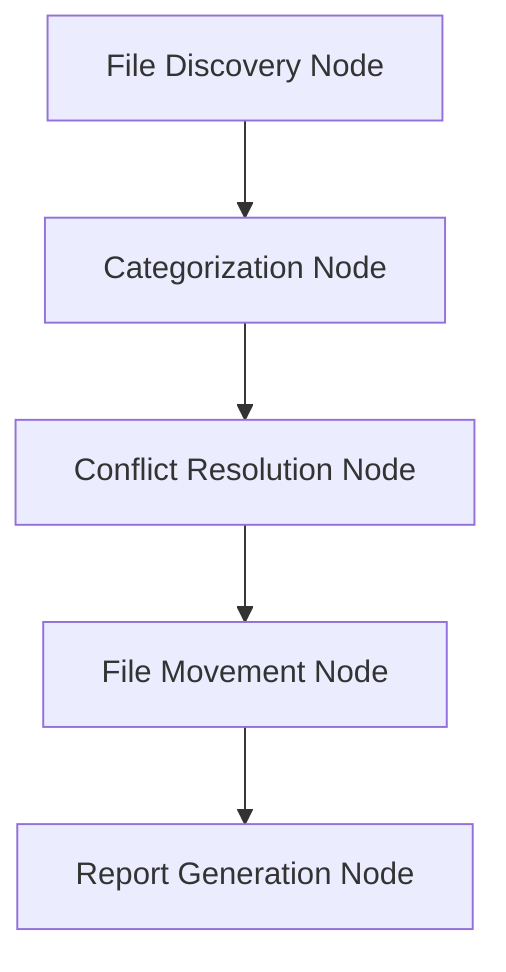

# Design Doc: File Organization Tool

> Please DON'T remove notes for AI

## Requirements

> Notes for AI: Keep it simple and clear.
> If the requirements are abstract, write concrete user stories

1. As a user, I want to categorize files from a source directory into a destination directory based on file type, creation date, and last modified date.
2. As a user, I want the system to handle name conflicts by renaming files appropriately.
3. As a user, I want to generate HTML and CSV reports of the organized files.

## Flow Design

> Notes for AI:
> 1. Consider the design patterns of agent, map-reduce, rag, and workflow. Apply them if they fit.
> 2. Present a concise, high-level description of the workflow.

### Applicable Design Pattern:

1. **Map** the files from the source directory into categorized chunks based on type and date, then **reduce** these chunks into the destination directory.
2. **Agentic file organizer**
   - *Context*: The entire set of files in the source directory
   - *Action*: Organize files into the destination directory

### Flow high-level Design:

1. **File Discovery Node**: Scans the source directory and retrieves file metadata.
2. **Categorization Node**: Categorizes files based on type, creation date, and last modified date.
3. **Conflict Resolution Node**: Handles name conflicts by renaming files.
4. **File Movement Node**: Moves files to the destination directory.
5. **Report Generation Node**: Generates HTML and CSV reports of the organized files.



## Utility Functions

> Notes for AI:
> 1. Understand the utility function definition thoroughly by reviewing the doc.
> 2. Include only the necessary utility functions, based on nodes in the flow.

1. **Get File Metadata** (`utils/get_file_metadata.py`)
   - *Input*: source_directory (str)
   - *Output*: list of file metadata (list)
   - Used by the File Discovery Node to retrieve file information.

2. **Categorize Files** (`utils/categorize_files.py`)
   - *Input*: list of file metadata (list)
   - *Output*: categorized files (dict)
   - Used by the Categorization Node to categorize files.

3. **Resolve Name Conflicts** (`utils/resolve_conflicts.py`)
   - *Input*: list of files (list)
   - *Output*: list of renamed files (list)
   - Used by the Conflict Resolution Node to handle name conflicts.

4. **Move Files** (`utils/move_files.py`)
   - *Input*: categorized files (dict), destination_directory (str)
   - *Output*: success status (bool)
   - Used by the File Movement Node to move files.

5. **Generate Reports** (`utils/generate_reports.py`)
   - *Input*: organized files (dict), report_type (str)
   - *Output*: report file (str)
   - Used by the Report Generation Node to create HTML and CSV reports.

## Node Design

### Shared Store

> Notes for AI: Try to minimize data redundancy

The shared store structure is organized as follows:

```python
shared = {
    "files": [],  # List of files to be organized
    "categorized_files": {},  # Dictionary of categorized files
    "conflict_resolved_files": [],  # List of files after conflict resolution
    "report_paths": []  # List of generated report paths
}
```

### Node Steps

> Notes for AI: Carefully decide whether to use Batch/Async Node/Flow.

1. **File Discovery Node**
   - *Purpose*: Scan the source directory and retrieve file metadata.
   - *Type*: Regular
   - *Steps*:
     - *prep*: Read source directory from user input
     - *exec*: Call `get_file_metadata` utility function
     - *post*: Store the list of files in the shared store

2. **Categorization Node**
   - *Purpose*: Categorize files based on type, creation date, and last modified date.
   - *Type*: Regular
   - *Steps*:
     - *prep*: Retrieve file metadata from the shared store
     - *exec*: Call `categorize_files` utility function
     - *post*: Store categorized files in the shared store

3. **Conflict Resolution Node**
   - *Purpose*: Handle name conflicts by renaming files.
   - *Type*: Regular
   - *Steps*:
     - *prep*: Retrieve categorized files from the shared store
     - *exec*: Call `resolve_conflicts` utility function
     - *post*: Store renamed files in the shared store

4. **File Movement Node**
   - *Purpose*: Move files to the destination directory.
   - *Type*: Regular
   - *Steps*:
     - *prep*: Retrieve renamed files and destination directory from user input
     - *exec*: Call `move_files` utility function
     - *post*: Update shared store with success status

5. **Report Generation Node**
   - *Purpose*: Generate HTML and CSV reports of the organized files.
   - *Type*: Regular
   - *Steps*:
     - *prep*: Retrieve organized files from the shared store
     - *exec*: Call `generate_reports` utility function for both HTML and CSV
     - *post*: Store report paths in the shared store
```

This design document outlines the structure and flow of the file organization tool, ensuring clarity and functionality while adhering to the specified requirements.