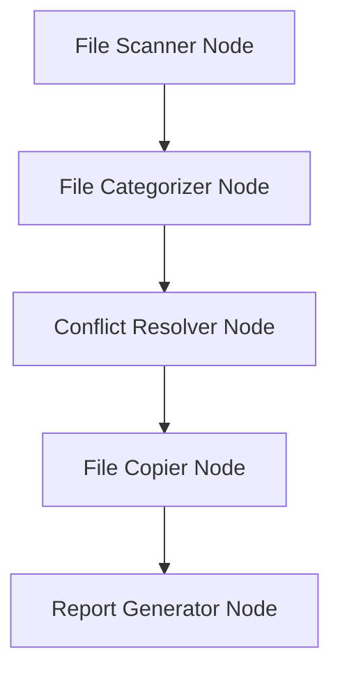

# Design Doc: File Organization Tool

## Requirements

1. As a user, I want to organize files from a source directory into a destination directory based on file type (images, videos, audio, other).
2. As a user, I want images and videos organized by year (YYYY) and month (MM-YYYY) in appropriate subdirectories.
3. As a user, I want audio files organized by artist and album in subdirectories.
4. As a user, I want other files to maintain their original organization structure.
5. As a user, I want intelligent conflict resolution:
   - For images/videos with same size: keep original
   - For images/videos with different size: add index number
   - For audio: keep the larger file
   - For other files: keep the newer file
6. As a user, I want HTML reports with thumbnails for images and videos, organized by year and month.
7. As a user, I want CSV reports for audio files (title, artist, album, path) and other files (name, directory, modified date).

## Flow Design

### Applicable Design Pattern:

1. **Map-Reduce**: Map files from source into categorized chunks by type and metadata, then reduce into organized destination structure.
2. **Workflow**: Sequential processing of file scanning, categorization, conflict resolution, copying, and report generation.

### Flow high-level Design:

1. **File Scanner Node**: Scans source directory recursively, extracting file metadata.
2. **File Categorizer Node**: Categorizes files by type and organizes them according to rules.
3. **Conflict Resolver Node**: Handles name conflicts with type-specific strategies.
4. **File Copier Node**: Copies files to destination with the resolved paths.
5. **Report Generator Node**: Creates HTML and CSV reports for the organized files.



## Utility Functions

1. **Scan Files** (`utils/scan_files.py`)
   - *Input*: source_directory (str)
   - *Output*: files_metadata (list)
   - Scans the source directory recursively and extracts metadata for each file.

2. **Categorize Files** (`utils/categorize_files.py`)
   - *Input*: files_metadata (list), destination_directory (str)
   - *Output*: categorized_files (dict)
   - Categorizes files by type and organizes them into year/month or artist/album subdirectories.

3. **Resolve Name Conflicts** (`utils/resolve_conflicts.py`)
   - *Input*: file_path (str), destination_directory (str)
   - *Output*: new_file_path (str)
   - Resolves name conflicts based on file type and metadata.

4. **Copy Files** (`utils/copy_files.py`)
   - *Input*: categorized_files (dict), destination_directory (str)
   - *Output*: None
   - Copies files to the destination directory.

5. **Generate Reports** (`utils/generate_reports.py`)
   - *Input*: organized_files (dict), report_type (str)
   - *Output*: report_file (str)
   - Generates HTML and CSV reports for the organized files.

## Node Design

### Shared Store

The shared store structure is organized as follows:

```python
shared = {
    "source_directory": str,
    "destination_directory": str,
    "file_metadata": [  # List of file metadata dicts
        {
            "path": str,  # Original path
            "type": str,  # "image", "video", "audio", "other"
            "size": int,  # File size in bytes
            "created": datetime,  # Creation date
            "modified": datetime,  # Last modified date
            "extra_metadata": {}  # Type-specific metadata (e.g., artist/album)
        }
    ],
    "categorized_files": {  # Mapped files by category
        "images": {original_path: destination_path},
        "videos": {original_path: destination_path},
        "audio": {original_path: destination_path},
        "other": {original_path: destination_path}
    },
    "conflict_resolved_files": {original_path: destination_path},
    "copied_files": {destination_path: metadata},
    "report_paths": {
        "html": [],
        "csv": []
    }
}
```

### Node Steps

1. **File Scanner Node**
   - *Purpose*: Scan the source directory recursively, extracting metadata for each file.
   - *Type*: Regular
   - *Steps*:
     - *exec*: Call the `scan_files` utility function.
     - *post*: Write scanned file metadata to the shared store.

2. **File Categorizer Node**
   - *Purpose*: Categorize files by type and organize them into destination subdirectories.
   - *Type*: Regular
   - *Steps*:
     - *prep*: Read file metadata from the shared store.
     - *exec*: Call the `categorize_files` utility function.
     - *post*: Write categorized files to the shared store.

3. **Conflict Resolver Node**
   - *Purpose*: Handle name conflicts with type-specific strategies.
   - *Type*: Regular
   - *Steps*:
     - *prep*: Read categorized files from the shared store.
     - *exec*: Call the `resolve_conflicts` utility function for each file.
     - *post*: Write resolved file paths to the shared store.

4. **File Copier Node**
   - *Purpose*: Copy files to the destination directory with the resolved paths.
   - *Type*: Regular
   - *Steps*:
     - *prep*: Read resolved file paths from the shared store.
     - *exec*: Call the `copy_files` utility function.
     - *post*: Update the shared store with copied files metadata.

5. **Report Generator Node**
   - *Purpose*: Generate HTML and CSV reports for the organized files.
   - *Type*: Regular
   - *Steps*:
     - *prep*: Read organized files from the shared store.
     - *exec*: Call the `generate_reports` utility function for both HTML and CSV formats.
     - *post*: Write report paths to the shared store.

````markdown
This design document outlines the requirements, flow design, utility functions, and node design for a file organization tool using PocketFlow. Each node is clearly defined, and the utility functions are tailored to support the overall functionality of the system.
````